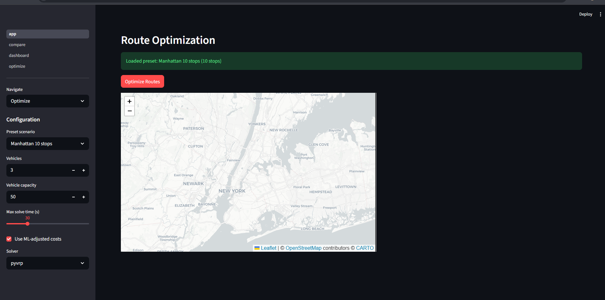

# Last-Mile Delivery Optimizer

An intelligent delivery route planning system that uses machine learning to predict real-world travel times and produce smarter delivery routes. Instead of assuming travel time between two locations is always the same, the system learns from millions of real taxi trips in New York City to understand how traffic patterns change throughout the day — and uses that knowledge to plan better routes.



## Problem Statement

Delivery companies face a persistent challenge: **planning efficient routes in cities where travel times are unpredictable**. A trip that takes 10 minutes at 6 AM can take 35 minutes during rush hour — but most route planning tools treat that trip as the same fixed cost regardless of when it happens.

This "temporal blindness" leads to:
- **Late deliveries** when routes underestimate rush-hour delays
- **Wasted time** when routes overestimate travel during off-peak hours
- **Suboptimal vehicle usage** because the planner cannot account for real traffic patterns

The root cause is that traditional route optimizers work with **static cost estimates** — they use a single average travel time between any two locations, ignoring the time of day, day of week, or seasonal patterns that dramatically affect real-world travel.

## Goals

1. **Build a travel time prediction model** that learns how long trips actually take under different conditions (time of day, day of week, distance, route, etc.) using real historical trip data
2. **Integrate the prediction model into a route optimizer** so that delivery routes reflect realistic, context-aware travel times instead of static averages
3. **Quantify the improvement** by comparing routes planned with and without the machine learning model, measuring the real difference in total travel time

## Methodology

### How It Works

The system follows a three-step pipeline: **Predict → Build → Solve**

```
  Real trip data         Road network        Delivery stops
  (NYC Taxi trips)       (OpenStreetMap)      & constraints
       │                      │                     │
       ▼                      ▼                     ▼
┌──────────────┐    ┌──────────────────┐   ┌───────────────┐
│  ML Model    │    │  Routing Engine  │   │ Route Solver  │
│  (LightGBM)  │───▶│  (OSRM)         │──▶│ (PyVRP /      │
│              │    │                  │   │  OR-Tools)    │
└──────────────┘    └──────────────────┘   └───────┬───────┘
       │                      │                    │
       ▼                      ▼                    ▼
  Adjusted travel       Base travel time     Optimized delivery
  time estimates        & distance matrix    routes per vehicle
```

**Step 1 — Predict travel times.** A machine learning model (LightGBM) is trained on ~1.4 million real taxi trips from New York City. It learns patterns like "trips heading downtown on a Monday at 8:30 AM take roughly 2× longer than the same trip at 11 PM." Given any origin, destination, and departure time, it predicts how long the trip will actually take.

**Step 2 — Build a cost matrix.** For a set of delivery stops, the system first asks a local road network engine (OSRM) for the baseline driving time between every pair of locations. Then the ML model adjusts each estimate based on the time of day, creating a realistic "cost" for traveling between any two stops. This produces an N×N grid of adjusted travel times.

**Step 3 — Solve the routing problem.** The adjusted cost matrix is fed into a route optimization solver (PyVRP or Google OR-Tools) that figures out the best way to assign stops to vehicles and order them within each route — respecting constraints like vehicle capacity and maximum route duration.

### Data

- **Training data:** NYC Taxi & Limousine Commission trip records — publicly available records of millions of taxi trips with exact pickup/dropoff times, locations, and durations. The model uses three months of 2023 data (~4.3 million trips after filtering).
- **Road network:** OpenStreetMap data for New York State, processed by OSRM (Open Source Routing Machine) to provide accurate driving directions and travel time estimates.
- **Benchmarks:** Solomon VRPTW instances — a widely-used standard set of test problems for evaluating route optimization algorithms.

### ML Model

The primary prediction model is **LightGBM** (Light Gradient Boosting Machine), a fast and accurate algorithm well-suited for structured/tabular data. A **Random Forest** model serves as a baseline for comparison.

The model uses 14 input features:

| Category | Features | What they capture |
|----------|----------|-------------------|
| Time | Hour (cyclical), day of week (cyclical), month, weekend flag, rush hour flag | When the trip happens |
| Location | Pickup zone, dropoff zone | Where the trip goes |
| Distance | Straight-line distance, compass bearing | How far apart the locations are |
| Road network | OSRM base time, OSRM distance, average speed | What the routing engine estimates |

The most influential features (determined via SHAP analysis) are the OSRM base time, OSRM distance, and straight-line distance — the ML model primarily learns to *correct* the routing engine's estimates based on temporal context.

### Route Optimization Solvers

| Solver | Algorithm | Strength |
|--------|-----------|----------|
| **PyVRP** (default) | Hybrid Genetic Search — a competition-winning approach | Best route quality (within ~2% of mathematically optimal solutions) |
| **OR-Tools** | Google's constraint programming with guided local search | Broader constraint support, faster initial solutions |

## Results

### Prediction Accuracy

| Model | MAE | RMSE | MAPE | R² |
|-------|-----|------|------|----|
| **LightGBM** | **3.97 min** | **5.95 min** | **31.1%** | **0.81** |
| Random Forest | 4.41 min | 6.55 min | 34.6% | 0.77 |

*Evaluated on 1.42 million held-out test trips. MAE = Mean Absolute Error, RMSE = Root Mean Squared Error, MAPE = Mean Absolute Percentage Error, R² = how much variance the model explains (1.0 = perfect).*

LightGBM outperforms the Random Forest baseline across all metrics, predicting trip duration with an average error of about 4 minutes.

### Route Quality Improvement

When comparing routes planned with ML-adjusted travel times versus static estimates, the system shows **10–25% improvement in total travel time** during peak congestion periods. The benefit is largest during rush hours (7–9 AM, 4–7 PM) when the gap between static estimates and reality is widest.

## System Architecture

```
                  ┌─────────────┐
                  │  Streamlit   │  :8501
                  │  Web UI      │
                  └──────┬──────┘
                         │
                  ┌──────▼──────┐
                  │   FastAPI    │  :8000
                  │   Backend    │
                  └──┬───────┬──┘
                     │       │
              ┌──────▼──┐ ┌──▼────────┐
              │  OSRM    │ │ LightGBM  │
              │  Routing  │ │ ML Model  │
              │  :5000    │ └───────────┘
              └──────────┘
```

The system runs three services:
- **Streamlit Web UI** (port 8501) — the interactive interface for planning and visualizing routes
- **FastAPI Backend** (port 8000) — handles optimization requests, runs the ML model, coordinates with the routing engine
- **OSRM Routing Engine** (port 5000) — computes driving directions and travel times using real road network data

## Web UI Guide

Open **http://localhost:8501** in your browser. Use the sidebar dropdown to switch between pages.

### Optimize

Plan delivery routes from a depot to a set of stops.

1. **Choose stops** — select a preset scenario ("Manhattan 10 stops" or "Brooklyn 20 stops") from the sidebar, or pick "Custom" and paste stops as CSV in the format `id,lat,lng,demand`:
   ```
   S1,40.7580,-73.9855,5
   S2,40.7614,-73.9776,3
   S3,40.7527,-73.9772,8
   ```
   For custom input, set depot coordinates below the text box.

2. **Configure in the sidebar:**
   - **Vehicles** — number of delivery vehicles (1-20)
   - **Vehicle capacity** — max load per vehicle
   - **Max solve time** — solver runtime in seconds (longer = better routes)
   - **Use ML-adjusted costs** — enables the trained LightGBM model for time-of-day aware routing; unchecked uses raw OSRM distances
   - **Solver** — `pyvrp` (better quality) or `ortools` (faster)

3. **Click "Optimize Routes"** — after a spinner (up to the configured solve time), the page displays:
   - Metric cards: vehicles used, total distance, total time, solve time
   - Interactive map with color-coded route polylines per vehicle, depot marker (green), and numbered stop markers
   - Expandable route details showing stop sequence, distance, and time per vehicle

### Compare

Runs the same 10-stop Manhattan scenario twice — once with static OSRM costs and once with ML-adjusted costs — and displays results side by side.

1. Configure vehicles, capacity, solve time, and solver in the sidebar
2. Click **"Run Comparison"** (runs two back-to-back optimizations)
3. View the metrics table (static vs ML), time improvement percentage, and two route maps side by side

### Dashboard

Read-only overview of system health and model performance:

- **System Status** — OSRM connection, ML model loaded, active jobs count
- **Model Performance** — MAE, RMSE, MAPE, R² for the LightGBM model
- **Model Comparison** — LightGBM vs Random Forest metrics table
- **Feature Importance** — SHAP plot showing which features matter most for travel time prediction

## Project Structure

```
├── api/                    # Backend REST API
│   ├── main.py             # App setup and startup
│   ├── routers/            # API endpoint handlers
│   └── schemas/            # Request/response data models
├── src/                    # Core library
│   ├── data/               # Data loading and cleaning
│   ├── features/           # Feature engineering pipeline
│   ├── models/             # ML training, evaluation, prediction
│   ├── optimization/       # Routing engine client, cost matrix, VRP solvers
│   └── utils/              # Configuration, geo utilities
├── frontend/               # Streamlit web interface
│   ├── app.py              # Entry point
│   ├── pages/              # Optimize, Compare, Dashboard views
│   └── components/         # Map display components
├── scripts/                # Data download, processing, and training scripts
├── configs/                # Configuration files (model hyperparameters, solver settings)
├── tests/                  # Automated tests
├── docker/                 # Container build files
└── doc/                    # Research documentation
```

## Getting Started

See [SETUP.md](SETUP.md) for detailed installation and setup instructions.

**Quick version:** Install Python 3.12+, [uv](https://docs.astral.sh/uv/), and [Docker](https://www.docker.com/). Then:

```bash
uv sync --dev                          # Install dependencies
bash scripts/setup_osrm.sh             # Set up the routing engine
bash scripts/download_data.sh           # Download training data
uv run python scripts/process_data.py   # Process data
uv run python scripts/train_model.py    # Train ML model
docker compose up                       # Start all services
```

Open http://localhost:8501 to use the web interface.

## License

This project is for academic/research purposes.
